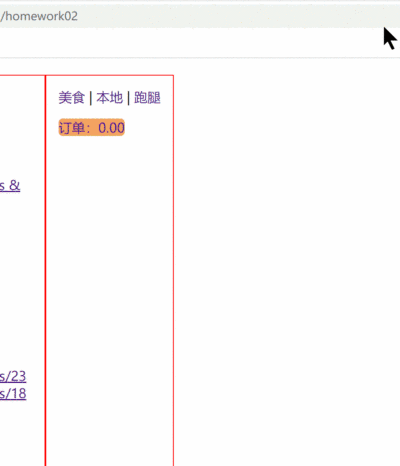

# Experiments

尝试基于需求实现。示例在`src/views/exp+`

### 实验一 Vue组件与路由实验

**实验目的**  
理解前端开发技术的作用与意义  
掌握前端开发工具的使用方法  
理解前端组件化设计思想  
掌握基于Vue的前端组件设计方法  
掌握vue组件的基本构成及实现方法  
掌握vue路由的实现方法

**实验内容**  
基于Web CSS实验，以前端组件化设计思想重新设计，基于Vue实现一个左侧边栏导航及右主要布局空间。再侧边栏设计若干路由导航，切换组件至右区域。

### 实验二 Vue双向绑定实验

**实验目的**  
理解MVVM设计思想  
掌握vue响应式数据绑定的方法  
掌握模板语法  
掌握vue 循环判断等基本指令  
掌握表单元素默认值的初始化方法

**实验内容**  
需求0  
为学生提供友好的，动态计算显式选修课学分功能组件  
可以超过12.0，无需限制  
动态显式选择课程学分/总学分

需求+1  
在右侧，动态显式选中的课程  
未达到条件时，累加学分显式红色，达到显式绿色  
由于较简单，不使用讲过的动态绑定class，尝试动态绑定style  
https://cn.vuejs.org/guide/essentials/class-and-style.html#binding-inline-styles

需求+1  
返回的课程不是按学期排序，加入选择数组也是按选择顺序而非学期，体验不好  
按学期排序显式；右侧显式选择的课程也动态按学期排序。不要在视图实现排序  
查询数组排序sort()函数  

### 实验三 单一数据源实验

**实验目的**  
理解单一数据源设计思想  
掌握vue组件路由传参的方法  
掌握嵌套路由的实现方法  
理解Javascript Proxy代理对象的特点  
掌握Store的声明配置方法  
掌握Store中响应式数数据的声明方法  
掌握Store中基于响应式数据的计算属性的声明方法  
掌握组件绑定Store数据的方法

需求0  
模拟外卖平台

模拟异步延迟网络请求Mock数据，获取shop列表，以及基于id获取指定shop数据的函数接口。  
模拟service业务逻辑，请求Mock数据。  
将组件与store解耦，所有数据通过业务逻辑获取，业务决定是否/如何使用store中缓存。

home组件，上路由导航，嵌套路由渲染标签。渲染切换location/shoplist组件  
location组件，加载空信息  
shoplist组件，加载shop列表，每个shop是一个路由导航，点击时路由到shop组件  
shop组件，基于传入的参数加载shop详细信息

需求+1  
orders包含若干order，每个order包含选定的item以及对应的数量  
shop组件，声明add函数，获取orders判断是否包含当前渲染的item，有则修改其数量，没有则创建新order对象加入orders数组  
声明remove函数，获取orders基于当前渲染的item减少order中数量，0则从orders数组移除对应的item  
shop组件，获取orders，绑定计算当前渲染的item在orders中的数量，没有显示0

需求+1  
ordercost组件，获取orders计算显示订单总花费，点击查看时路由切换到订单详情  
home组件，渲染ordercost组件  
order组件，显示订单详情

需求+1  
Store中缓存，shop列表/shop详细列表/order列表  
实现支持从缓存:加载shop列表信息，加载指定shop详细信息，加载orders信息。

### 实验四 网络请求实验

**实验目的**  
掌握基于网络请求响应的基本方法  
掌握请求/响应拦截器的声明使用方法  
掌握封装Fetch请求的方法  
掌握基于miragejs库mock数据的使用方法  
掌握整合VueUse store/useFetch()的方法  
掌握前后端互交接口的设计原则  
掌握sessionstorage的使用方法

**实验内容**

安装miragejs依赖至开发环境下，创建基本配置文件  
在main.ts入口按开发环境引入配置文件  
声明基于约定的ResultVO接口  
实现Fetch基本配置  
实现Fetch请求/响应拦截器  
实现get/post请求的封装

需求0  
创建miragejs mock登录请求函数  
模拟校验用户输入的账号密码，组装ResultVO对象，错误则返回登录失败业务码；成功则在body返回用户信息，header返回token/role数据  
编写service层登录业务函数，调用Fetch相应函数实现网络请求  
登录成功将响应header中的token/role数据存入sessionstorage  
编写全局警告模态框  
编写登录组件，调用service登录函数
