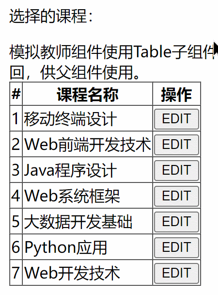

# Homework

### Homework-01

#### 需求0
在视图组件内，无需配置路由实现功能组件的切换。  
将组件功能名称以可点击的上导航渲染，当点击指定功能时切换组件，并特殊显式当前激活组件名称。

### Homework-02
  

#### 需求0
在多个功能中均需要定位部门下的教师，但获取到教师后的业务操作却不同。例如，需要定位教师重置密码，移动到不同部门，移除等操作。  
因此通过创建独立内聚的包含通过部门定位教师的子组件实现。  

组件包括，加载所有专业以下拉菜单渲染，当选择专业时，异步加载专业下全部教师，以一个新下拉菜单渲染。   
当选择教师时，组件将该教师数据对象暴露供外部父组件使用。  
从而，独立子组件封装独立功能，无需关心父组件如何使用返回的数据对象。  

### Homework-03
  

#### 需求0
当子组件可部分复用，但仍有少部分需由父组件决定渲染内容时，子组件可通过slot接收父组件内容。  
需求：教师/学生2个组件均需渲染信息相同的课程列表，但教师组件需多渲染一个操作列，实现可复用的Table组件。   

模拟教师组件使用Table子组件。渲染功能列，且可从子组件通过slot将所需数据返回，供父组件使用。  

模拟学生组件使用Table子组件。没有渲染操作功能。  
