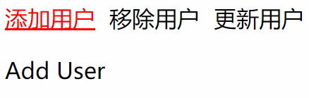

# Homework

### Homework-04
  

#### 需求0
当子组件可部分复用，但仍有少部分需由父组件决定渲染内容时，子组件可通过slot接收父组件内容。  
需求：教师/学生2个组件均需渲染信息相同的课程列表，但教师组件需多渲染一个操作列，实现可复用的Table组件。   

模拟教师组件使用Table子组件。渲染功能列，且可从子组件通过slot将所需数据返回，供父组件使用。  

模拟学生组件使用Table子组件。没有渲染操作功能。  

### Homework-03
  

#### 需求0
在多个功能中均需要定位部门下的教师，但获取到教师后的业务操作却不同。例如，需要定位教师重置密码，移动到不同部门，移除等操作。  
因此通过创建独立内聚的包含通过部门定位教师的子组件实现。  

组件包括，加载所有专业以下拉菜单渲染，当选择专业时，异步加载专业下全部教师，以一个新下拉菜单渲染。   
当选择教师时，组件将该教师数据对象暴露供外部父组件使用。  
从而，独立子组件封装独立功能，无需关心父组件如何使用返回的数据对象。  

### Homework-02

#### 需求0
模拟外卖平台  

home组件，上路由导航，嵌套路由渲染标签。渲染切换location/foods组件  
location组件，加载空信息  
foods组件，加载shop列表，每个shop是一个路由导航，点击时路由到shop组件  
shop组件，基于传入的参数加载shop全部item，循环渲染  

#### 需求+1
orders包含若干order，每个order包含选定的item以及对应的数量；orders数组保存在pinia  
shop组件，声明add函数，获取orders判断是否包含当前渲染的item，有则修改其数量，没有则创建新order对象加入orders数组  
声明remove函数，获取orders基于当前渲染的item减少order中数量，0则从orders数组移除对应的item  
可在组件内直接操作orders数组中元素，仅替换整合数组引用时使用同步/异步事件  
shop组件，获取orders，绑定计算当前渲染的item在orders中的数量，没有显示0

#### 需求+1
home组件，获取orders计算显示订单花费  
order组件，显示订单详情  
将订单设为路由，路由切换到订单详情

#### 需求+1
将数据加载由vuex执行  
vuex state声明shopList，foods中shop列表绑定shopList  
路由到foods组件时，执行异步事件拉取shoplist，加载时先判断如果state已经存在则不执行加载，没有则加载  
同理，vuex声明shopCache，用于缓存已经拉取的shop详细信息  
进入shop组件时，异步加载shop详细信息，当shopCache中已经包含，即曾经加载过，则直接使用；没有则加载，并置于shopcache中

### Homework-01

#### 需求0
为学生提供友好的，动态计算显式选修课学分功能组件  
可以超过17.5，无需限制  
动态显式选择课程学分/总学分  

#### 需求+1
在右侧，动态显式选中的课程  
未达到条件时，累加学分显式红色，达到显式绿色  
由于较简单，不使用讲过的动态绑定class，尝试动态绑定style  
https://vue3js.cn/docs/zh/guide/class-and-style.html#对象语法-2

#### 需求+1
返回的课程不是按学期排序，加入选择数组也是按选择顺序而非学期，体验不好  
按学期排序显式；右侧显式选择的课程也动态按学期排序。不要在视图实现排序  
查询数组排序sort()函数