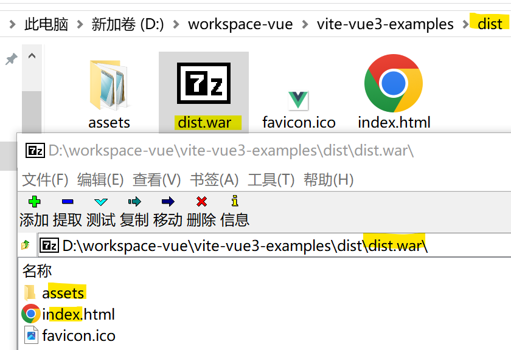

# 项目设计

### 项目要求

项目设计占总成绩40%，验收时间待定。  
每名学生基于vue/react等前端框架，独立完成以下系统的实现。  
鼓励使用element-ui/vuetify等UI框架，有加分。  
应合理使用异步组件/全局模态框组件/函数式组件/插槽等技术。  
所有数据均在前端模拟，无需后端实现。  
部署服务器有加分。  
推送到github/gitee远程仓库，有多次提交节点，好好维护readme，有加分。

### 实验室预约系统

完成一个允许教师灵活预约课程实验时间的实验室预约系统。

#### 需求与设计

**基础**  
基于需求，合理设计接口及数据类型约束。  
系统默认包含4个实验室可以预约。  
共18周，每实验室支持上午2段(1234节)下午2段(5678节)共4次课。  
系统需登陆使用。  
**需求**  
教师，需先创建包含课程名称，学时的实验课若干。录入课程后，基于课程预约。  
实验时间固定。例如，预约901，1-8周每周二12节；902，1-8周每周四56节等。

**设计**  
学生自行设计实现。  
例如，以下拉选择实验室，实验室以类似课表形式渲染显示18周内每星期每段的占用情况。  
教师基于周次选择实验时间，一个cell里显示18个周的复选框。  
预约后，每门课程插入包含实验室/周次/星期/节组成的实验时间数组。  
系统必须提供实验时间不能冲突检测。例如，选择实验室时，从所有课程实验时间中，检索出当前实验室占用情况提供给教师参考，强制教师无法选择冲突时段。即，同一时间段只能有一门实验课。  
以及课程预约时间不能超过实验课时的检测。

### 打包部署

**相对路径打包**

项目运行在服务器下的学号路径下，因此与Web课设部署相同，所有文件的引用必修使用相对路径。  
`vite.config.ts`添加配置，按相对路径编译。

```js
export default defineConfig({
  plugins: [vue()],
  base: './' // 相对路径打包
  // ...
})
```

**miragejs mock请求数据**

数据可以使用静态数据，不使用网络请求。  
如果使用miragejs mock数据，需要在编译时强制引入miragejs，修改`main.ts`为直接引入而非判断环境

```js
// import.meta.env.DEV && (await import('@/mock/index'))
import('@/mock/index')
```

**路由守卫重定向**

如果设置了登录状态判断的路由守卫，默认未登录路由到地址`/login`，需修改为相对地址`login`

**编译打包**

运行`npm run build`命令，在项目下生成编译结果`dist`目录。  
资源管理器进入`dist`目录，将目录下全部文件(`index.html`+`assets`)，而非将`dist`目录，压缩为`zip`文件。  
将`zip`文件扩展名修改为`war`，即`dist.war`。`zip/war`使用相同的压缩算法。  
登录平台，上传war包自动部署。


